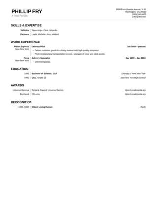

# JobApp

A latex style for resumes. Includes Dockerfile to build the resume PDF from `.tex` source.

[](./example.jpeg)

## Build

```sh
docker build -t jobapp .
```

## Usage

1. `cp example.tex myresume.tex`
2. Update `myresume.tex` with desired information
3. Build the PDF:
   ```sh
   docker run --rm -it -v "$(pwd):/data" --user="$(id -u):$(id -g)" jobapp lualatex -synctex=1 -interaction=nonstopmode myresume.tex
   ```
4. View output file: `myresume.pdf`
